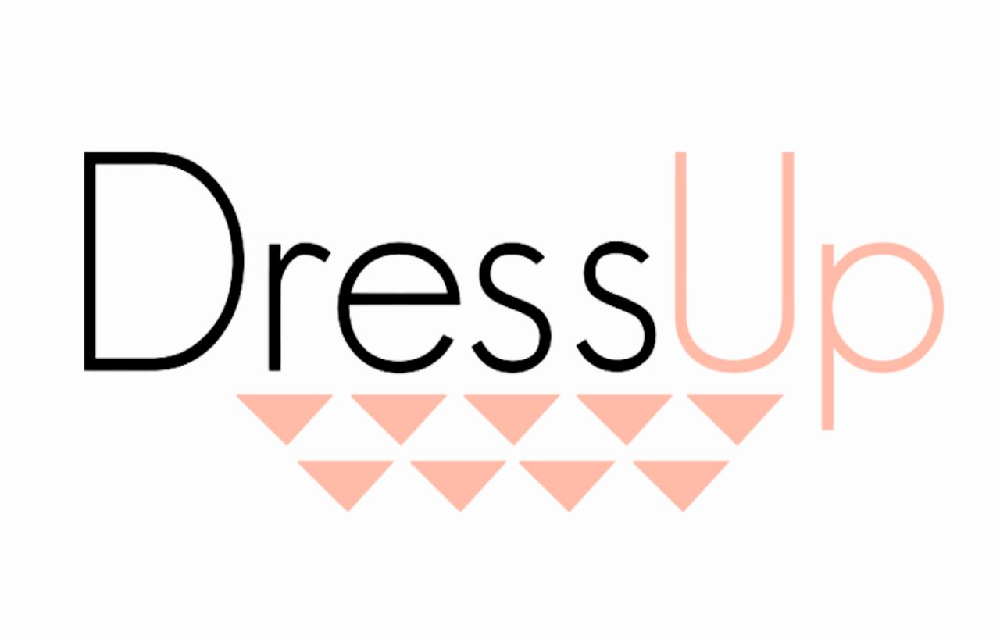

<!-- PROJECT LOGO -->
<a name="readme-top"></a>
<br />
<div align="center">
  <a href="https://github.com/chetantidgam123/shopdress">
    
  </a>

<h3 align="center">Shopdressup</h3>

  <p align="center">
    project_description
    <br />
    <a href="https://github.com/chetantidgam123/shopdress"><strong>Explore the docs »</strong></a>
  </p>
</div>


<!-- TABLE OF CONTENTS -->
<details>
  <summary>Table of Contents</summary>
  <ol>
    <li>
      <a href="#about-the-project">About The Project</a>
      <ul>
        <li><a href="#built-with">Built With</a></li>
      </ul>
    </li>
    <li>
      <a href="#getting-started">Getting Started</a>
      <ul>
        <li><a href="#prerequisites">Prerequisites</a></li>
        <li><a href="#installation">Installation</a></li>
      </ul>
    </li>
    <li><a href="#contributing">Contributing</a></li>
  </ol>
</details>


<!-- ABOUT THE PROJECT -->
## About The Project

[![Product Name Screen Shot][product-screenshot]](https://example.com)

Shopdress Up(formerly Grofers) This project is the clone of ShopdressUp.in which is a Cloth and accessories selling and
delivering website.
<p align="right">(<a href="#readme-top">back to top</a>)</p>


### Built With
<p align="center">
    
    
    
    
    
    
  
 
</p>


<p align="right">(<a href="#readme-top">back to top</a>)</p>


<!-- GETTING STARTED -->
## Getting Started

In this project we worked in group so we set up the the git repositary for transfer the code from one member to other

### Prerequisites

This is how we work on project.
* Work Allotment
  ```sh
 Divide the work as per pages.
  ```
  * Go through Working Website
  ```sh
 Go through Working Website and undestranding the flow of pages and collecting data.
  ```
  * Merging Code
  ```sh
 Merge the all code and used making component for same code for reusability.
  ```

### Installation

1. Visual Studio Code
2. Clone the repo
   ```sh
   git clone https://github.com/chetantidgam123/shopdress
   ```
<p align="right">(<a href="#readme-top">back to top</a>)</p>


<!-- CONTRIBUTING -->
## Contributing

Contributions are what make the open source community such an amazing place to learn, inspire, and create. Any contributions you make are **greatly appreciated**.

If you have a suggestion that would make this better, please fork the repo and create a pull request. You can also simply open an issue with the tag "enhancement".
Don't forget to give the project a star! Thanks again!

1. Fork the Project
2. Create your Feature Branch (`git checkout -b feature/AmazingFeature`)
3. Commit your Changes (`git commit -m 'Add some AmazingFeature'`)
4. Push to the Branch (`git push origin feature/AmazingFeature`)
5. Open a Pull Request

<p align="right">(<a href="#readme-top">back to top</a>)</p>

<!-- MARKDOWN LINKS & IMAGES -->
<!-- https://www.markdownguide.org/basic-syntax/#reference-style-links -->
[contributors-shield]: https://img.shields.io/github/contributors/github_username/repo_name.svg?style=for-the-badge
[contributors-url]: https://github.com/github_username/repo_name/graphs/contributors
[forks-shield]: https://img.shields.io/github/forks/github_username/repo_name.svg?style=for-the-badge
[forks-url]: https://github.com/github_username/repo_name/network/members
[stars-shield]: https://img.shields.io/github/stars/github_username/repo_name.svg?style=for-the-badge
[stars-url]: https://github.com/github_username/repo_name/stargazers
[issues-shield]: https://img.shields.io/github/issues/github_username/repo_name.svg?style=for-the-badge
[issues-url]: https://github.com/github_username/repo_name/issues
[license-shield]: https://img.shields.io/github/license/github_username/repo_name.svg?style=for-the-badge
[license-url]: https://github.com/github_username/repo_name/blob/master/LICENSE.txt
[linkedin-shield]: https://img.shields.io/badge/-LinkedIn-black.svg?style=for-the-badge&logo=linkedin&colorB=555
[linkedin-url]: https://linkedin.com/in/linkedin_username
[product-screenshot]: ./img/Capture.jpeg
[HTML]: https://cdn-icons-png.flaticon.com/128/1051/1051277.png
[Html-url]: https://www.tutorialspoint.com/html/html_tutorial.pdf
[CSS]:https://cdn-icons-png.flaticon.com/128/5968/5968242.png
[Css-url]: https://www.tutorialspoint.com/css/css_tutorial.pdf
[js.js]: https://cdn-icons-png.flaticon.com/128/5968/5968292.png
[js-url]: https://matfuvit.github.io/UVIT/predavanja/literatura/TutorialsPoint%20JavaScript.pdf


 
